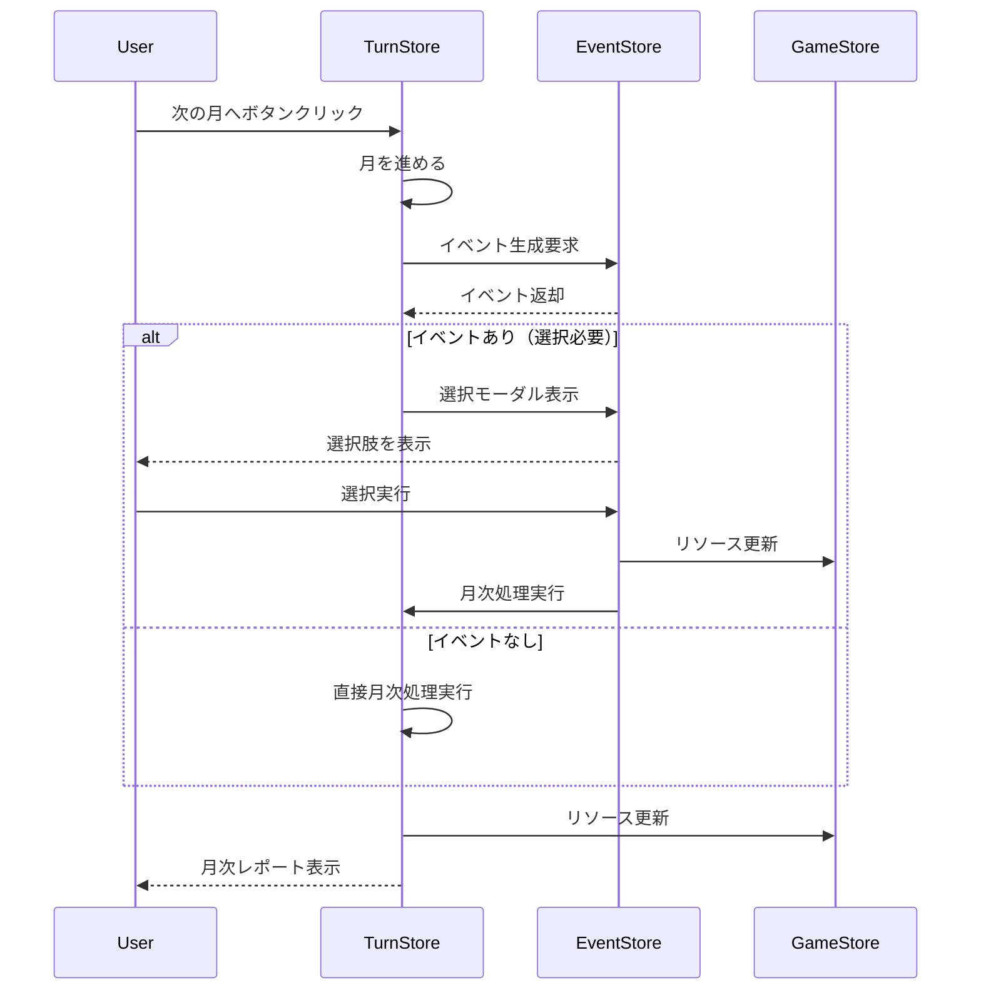
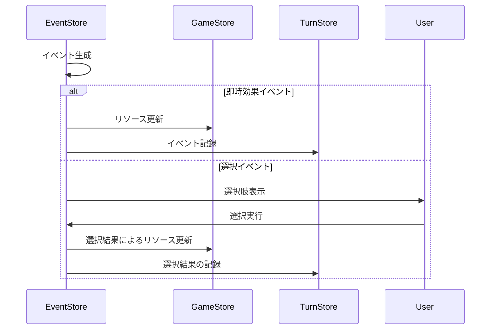

# Technical Documentation

## アーキテクチャ概要

### 状態管理システム
プロジェクトではZustandを採用し、以下の4つのストアで状態を管理しています：

#### gameStore
ゲームの基本状態を管理する中核ストア
```typescript
interface GameState {
  status: GameStatus;        // PLAYING | GAME_OVER | PAUSED
  resources: {
    POPULATION: Resource;    // 人口
    FOOD: Resource;         // 食料
    ENERGY: Resource;       // エネルギー
    MILITARY: Resource;     // 軍事力
    SUPPORT: Resource;      // 市民支持率
    CREDITS: Resource;      // 通貨
  };
  // アクション
  updateResource: (type: ResourceType, amount: number) => void;
  checkGameOver: () => boolean;
}
```

#### turnStore
ターン進行と月次処理を管理
```typescript
interface TurnState {
  currentDate: GameDate;
  reportDate: GameDate;
  monthlyEvents: MonthlyEvent[];
  pendingMonthEnd: boolean;  // 月次処理の保留状態

  // 主要なアクション
  advanceMonth: () => void;        // 月を進める
  processMonthEnd: () => void;     // 月次処理を実行
  addEvent: (event: MonthlyEvent) => void;  // イベントを追加
}
```

#### eventStore
イベントシステムの状態と処理を管理
```typescript
interface EventState {
  currentEvent: RandomEvent | null;
  handledEvents: string[];          // 処理済みイベント
  showEventChoice: boolean;         // 選択モーダルの表示状態

  // イベント処理関連
  generateRandomEvent: () => RandomEvent | null;
  handleEventChoice: (event: RandomEvent, choice: EventChoice) => void;
  handleImmediateEvent: (event: RandomEvent) => void;
}
```

#### economyStore
経済システムの状態と計算を管理
```typescript
interface EconomyState {
  incomeSources: Record<string, IncomeSource>;
  expenseCategories: Record<string, ExpenseCategory>;
  
  // 経済計算
  calculateDetailedIncome: () => Record<string, number>;
  calculateDetailedExpenses: () => Record<string, number>;
}
```

### ストア間の連携フロー

1. 月次進行の処理フロー


2. イベント処理のフロー


## 主要コンポーネントの実装詳細

### GameLayout
ゲーム画面の基本レイアウトを提供
```typescript
const GameLayout = ({ children }: { children: React.ReactNode }) => {
  const { currentEvent, showEventChoice, closeEventChoice } = useEventStore();

  return (
    <div className="flex h-screen bg-background">
      <NavSidebar />
      <main className="flex-1 flex flex-col">
        <StatusBar />
        <div className="flex-1 p-6">{children}</div>
        <TurnControl />
      </main>
      {showEventChoice && currentEvent && (
        <EventChoiceModal
          event={currentEvent}
          onClose={closeEventChoice}
        />
      )}
    </div>
  );
};
```

### MonthlyReportModal
月次レポートの表示を担当
- 通常報告とイベント報告を分離して表示
- イベントの影響を含むリソース変動を表示
- 選択したイベントの結果を表示

### EventChoiceModal
イベント選択UIを提供
- イベントの説明表示
- 選択肢とその予測される影響の表示
- 選択結果の反映とストアへの通知

## イベントシステムの実装詳細

### イベントの定義
```typescript
interface RandomEvent {
  id: string;
  title: string;
  category: RandomEventCategory;
  description: string;
  probability: number;        // 発生確率
  condition?: {              // 発生条件
    resources?: Record<string, number>;
    turn?: number;
  };
  choices?: EventChoice[];    // 選択肢
  immediateEffects?: {       // 即時効果
    resources: Record<string, number>;
    support?: number;
  };
}
```

### イベントの生成と処理
1. 確率による発生判定
2. 条件チェック（リソース条件など）
3. イベント種別の判定（選択 / 即時）
4. 効果の適用とレポートへの記録

## 経済システムの実装詳細

### 収入計算
```typescript
calculateDetailedIncome: () => {
  const { POPULATION, SUPPORT } = gameStore.resources;
  
  // 基本収入の計算
  const taxIncome = POPULATION.current * 10;  // 1人あたり10クレジット
  const supportBonus = (SUPPORT.current / 100) * 0.2 + 1;
  
  return taxIncome * supportBonus;
}
```

### 支出計算
```typescript
calculateDetailedExpenses: () => {
  const { POPULATION, MILITARY } = gameStore.resources;
  
  const basicExpenses = POPULATION.current * 5;  // 基本支出
  const militaryExpenses = MILITARY.current * 20;  // 軍事支出
  
  return basicExpenses + militaryExpenses;
}
```

## 月次処理の実装詳細

### 処理順序
1. イベント処理
   - ランダムイベントの生成と処理
   - 選択イベントの場合は選択を待機
2. 経済計算
   - 収入の計算
   - 支出の計算
   - 収支の反映
3. リソース自動変動
   - 人口の自然変動
   - 食料消費
   - エネルギー消費
4. 支持率変動
5. レポート生成
6. 次の月への準備

## ゲームオーバー判定の実装

### 即時ゲームオーバー条件
```typescript
checkGameOver: () => {
  const { POPULATION, FOOD, ENERGY, SUPPORT } = resources;
  
  // 即時ゲームオーバー条件
  if (POPULATION.current <= 0) return true;
  
  // 段階的なゲームオーバー条件
  if (FOOD.current <= 0 && FOOD.timeToEffect === 0) return true;
  if (ENERGY.current <= 0 && ENERGY.timeToEffect === 0) return true;
  if (SUPPORT.current <= SUPPORT.criticalThreshold && 
      SUPPORT.timeToEffect === 0) return true;
  
  return false;
}
```

## パフォーマンス最適化

### メモ化の使用
- 重い計算を行うコンポーネントでuseMemoを使用
- イベントハンドラーにuseCallbackを使用

### 状態更新の最適化
- バッチ更新の活用
- 不要な再レンダリングの防止

## 今後の技術的な課題
1. 施設システムの実装
2. セーブ/ロードシステムの実装
3. 外交システムの実装
4. パフォーマンス最適化の継続
5. テストの充実化